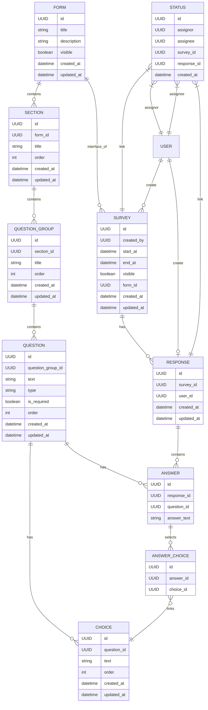

# 校務系統開發與管理

### 期進度報告

 
<!-- 
學生：洪晙宸  
專案導師：尤淑芬 -->
洪晙宸

---

# 專案學期目標

- Portal修改任務交付
- 不法侵害預防計畫管理系統
  - 問卷建置、管理、填寫系統
  - 類似公文簽核的問卷審核流程
  - 其他既有資訊整合(ex. 人事資料、館舍資料)
  - 我負責後端開發，部分前端支援
- Oauth維護

---

# Portal - inline css

- 透過腳本把inline CSS轉換成class
  - 根據原始的style產生hash字串，有相同hash的話可以複用class
  - 為確保行為相同，產生出的class會加上 `!important`

---

# Portal - 校園智多星

- 照主管會議結論把校園智多星的連結置於左側

---

# Portal - VPN跳轉頁面

- 使用 element-ui 的元件，維持風格一致性
- 由後端導回至前端，帶上 `service` 的query param，這樣使用者可以在連線完成後用右邊的按鈕嘗試再進入一次系統
- 結合i18n，達成雙語化，英文版的會給英文版的使用說明

---
layout: two-cols
---

# 不法侵害問卷

- ERM設計
- 架構設計

{class="bg-white p-3 w-85%"}
[by 張百寬]{class="text-sm"}

::right::

---
layout: image-right
image: /flow-queue.png
backgroundSize: contain 
---

# 不法侵害問卷

- 原預期進度
  - 弱點掃描 & 源碼檢測
  - 更多的測試
- 實際進度
  - 除了原先的表單外，有其他需求逐漸在浮現
    - 類似公文簽核的審核系統
    - 需要整合人事及館舍資料
  - 前端需求上升，因此前去協助前端的呈現

---

# 不法侵害問卷

---

# Oauth

- 修正前端選單問題
- 遷移文檔位置
- 版本更新研究

---

# 後續預期進度

- 持續配合portal交付的任務
- 不法侵害問卷
  - 預計九月上線
  - 持續和行政單位開會確認進度與需求
- Oauth
  - 既有服務眾多，實際更新需要審慎測試
  - 已申請測試機，測試完成後

---

# 結論與建議

- 部分系統仍然限制實驗室的ip
  - 實驗室新增供同學連線的機器
  - 提供vpn供同學使用
