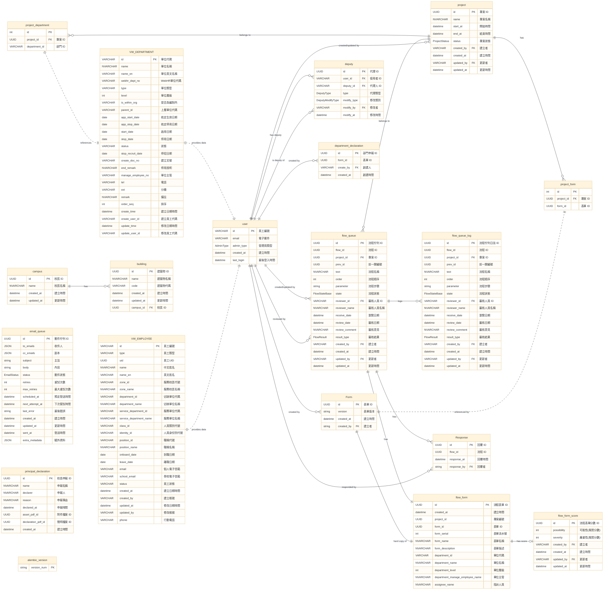

# 校務系統開發與管理

### 期末進度報告

 

學生：洪晙宸  
專案導師：謝旻錚、施仁忠  
協助同仁：傅俊城、尤淑芬

---

# 專案學期目標

- Oauth維護
  - 部屬至正式機
  - 修正上線後發現的問題
- 職務不法侵害預防計畫管理系統
  - 修正系統問題

---
layout: image-right
image: /image.png
backgroundSize: contain
---

# 工作項目：Oauth部屬至正式機

- 將期中前的進度部屬至正式機
- 為確保遷移正確，更新時僅將當前db資料複製出來，並用docker部屬
- 同時修正申請信件不會寄出的問題

---
layout: image-right
image: /image2.png
backgroundSize: contain
---

# 工作項目：Oauth更換明年度憑證

- 收到的憑證並沒有敘述如何使用，更新後經使用者回報才發現問題
- 將組合憑證的文件補齊，以便維護

---

# 工作項目：恢復之前代理人的單一結構

https://github.com/NYCUITSC/Prevention-backend/issues/67

- 期中所做的東西過於複雜，和使用者溝通後，將代理人系統變回更簡單的模式方便維護
  - 系統會定期從人事資料撈取預設的人事資料
  - 系統管理員可以根據實際情況設定代理人覆蓋人事資料問題
  - 不論是發送問卷前調查跟發送問卷後補救在系統內都可以正常運作

---
layout: image-right
image: /image4.png
backgroundSize: contain
---

# 工作項目：附件二若遇到主管調換，應封存當前的flow並派發新的flow

https://github.com/NYCUITSC/Prevention-backend/issues/64

- 因為花比較多的時間處理附件三/附件四，期望可以用類似的邏輯套用在附件二。所以原先附件二的實作方式較為簡單
- 問題：附件二在指派後會堆疊，同一個單位可能有多個附件二
- 目標：跟需求單位確認後，舊的表單要封存，再發新的表單給新的主管
- 方法：指派附件二時，先檢查有沒有正在進行的表單，有的話系統進行封存再指派新的表單出去

---

# 工作項目：文件撰寫

- 系統分析文件及各項模組文件
- ERM Model補齊
- 為方便部屬，簡化部屬流程並嘗試讓資中同仁有辦法部屬到正式機

---
layout: cover
---

# 問題與討論