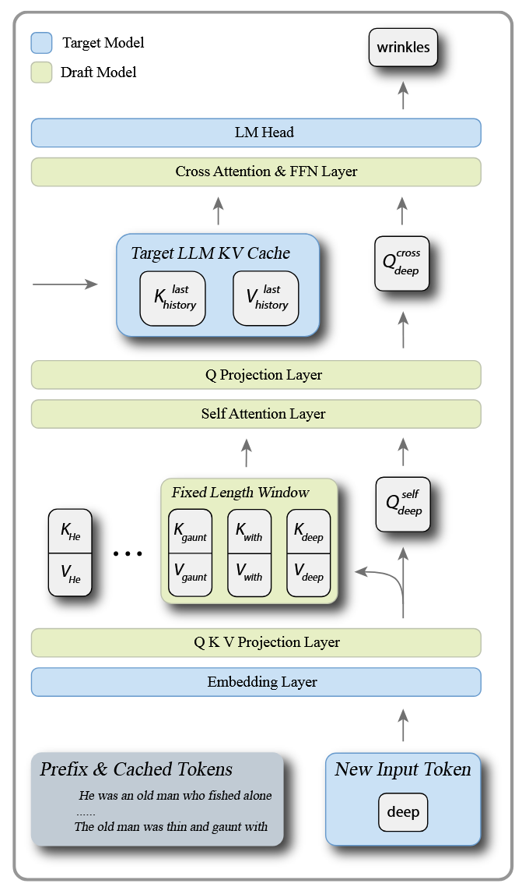
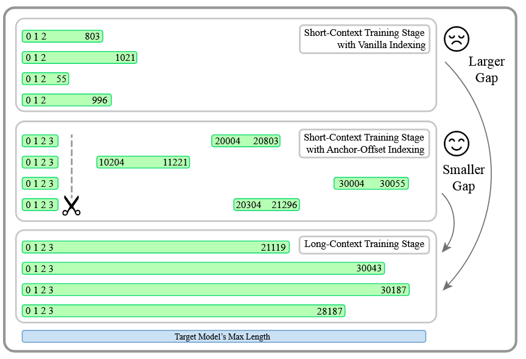
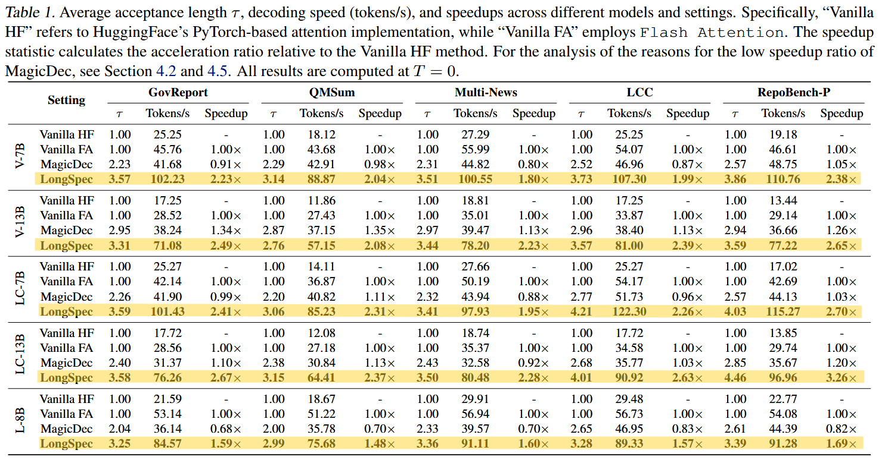
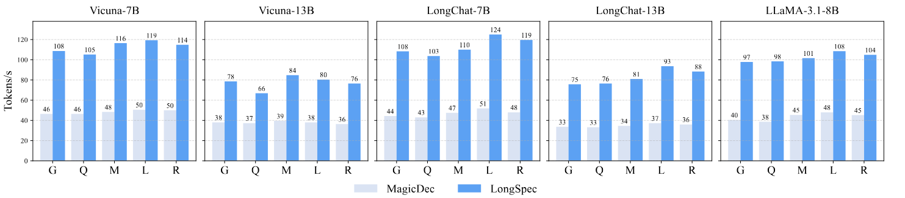

## **LONGSPEC: Long-Context Lossless Speculative Decoding with Efficient Drafting and Verification**
Penghui Yang, Cunxiao Du, Fengzhuo Zhang, Haonan Wang, Tianyu Pang, Chao Du, Bo An 
ICML 2025 Workshop (ES-FoMo III) Poster

2026/01/03 
Jun-Chen Hung 
Advisor: Wen-Chih Peng

---

# Introduction

- Challenge: While Speculative Decoding (SD) accelerates LLMs, state-of-the-art methods struggle with long contexts (100k+ tokens) due to prohibitive memory demands and training data scarcity.
- Solution: **LONGSPEC** provides a framework for lossless acceleration specifically designed for long-context scenarios
  - Memory-Efficient Architecture
  - Anchor-Offset Indices
  - Hybrid Tree Attention

---

# Related work
Speculative decoding

- Draft generation
- Parallel verification
- Rejection sampling

  

  

---

# Related Work
Retrieval & Training-Free Methods

**Overview:**
These approaches attempt to accelerate inference without the overhead of training extensive new draft models.

*   **Retrieval-Based Decoding:** Methods like **REST** and **Ouroboros** utilize $N$-gram matching or retrieval techniques.
*   **Mechanism:** Instead of generating tokens via a neural network, they draft sequences by identifying existing data patterns within the context.
*   **Benefit:** Bypasses the need for additional model training and leverages pre-existing context information.

---

# Related Work
Existing Long-Context Acceleration

**Overview:**
A few recent frameworks have attempted to adapt speculative decoding specifically for long-context scenarios.

*   **Target-as-Draft Approaches:** Methods like **TriForce**, **MagicDec**, and **QuantSpec** typically use the target model itself (or a version of it) as the draft model.
*   **Compression Techniques:** To make the target model faster for drafting, they employ techniques like sparse Key-Value (KV) caches or 4-bit quantization.
*   **Goal:** These aim to handle the extended memory requirements of long sequences without training a separate lightweight architecture.

---

# Problem

- Existing solutions cannot solve the specific problems addressed by **LONGSPEC** due to three critical limitations:

  1.  **Memory Bottlenecks (Standard SD)**: SoTA methods like EAGLE are trained on short texts (<4k tokens). Their KV cache grows linearly, causing prohibitive memory usage when applied to long contexts (100k+ tokens).
  2.  **Training-Inference Mismatch**: Models trained on abundant short sequences fail to generalize to long contexts due to "out-of-distribution" position indices. Standard RoPE extrapolation fails because draft models must match the target model's fixed base.
  3.  **Inefficient Drafting (Existing Long-Context SD)**: Methods like MagicDec rely on heavy target models (even with sparse KV). This remains computation-intensive, limiting speedups especially in low-batch scenarios compared to a dedicated lightweight drafter.

---

# Solution

  

  1.  **Memory-Efficient Architecture:** A lightweight draft model with **constant memory usage** that reuses the target model's cache.
  2.  **Anchor-Offset Indices:** A training strategy enabling models trained on short sequences to generalize to **long contexts**.
  3.  **Hybrid Tree Attention:** A verification mechanism combining **Flash Attention** with custom kernels for maximum speed.

  

  

---

# Solution
Memory-Efficient Architecture

- **The Problem:** Standard autoregressive draft models maintain their own growing KV cache, creating a memory bottleneck in long-context tasks [2].
- **The Design:**
  - **Constant-Sized Cache:** The draft model uses **sliding-window self-attention** (window size = 512). This ensures memory usage remains constant regardless of input length.
  - **Cross-Attention Reuse:** Instead of storing a full history, the draft model uses cross-attention to directly access the **frozen KV cache of the target model**.
  - **Weight Sharing:** To further reduce memory overhead, the draft model shares the Embedding Layer and LM Head weights with the target model, similar to EAGLE.

---

# Solution
Anchor-Offset Indices

- **The Problem:** Draft models are trained on short data, but inference requires handling long position indices (e.g., token 100,000). Standard RoPE extrapolation fails because the target model's base is fixed.
- **The Strategy:**
  - **Simulated Long Positions:** During short-sequence training, the model reserves the first few tokens as **Anchors** (indices 0-3) to capture attention sinks.
  - **Random Offsets:** For subsequent tokens, it assigns large, random position indices (e.g., jumping to index 8192+) to simulate long-context distribution.
  - **Flash Noisy Training:** A technique that randomly shifts indices during training to simulate the visibility constraints (cache vs. speculation) seen during inference, without breaking Flash Attention compatibility.

---

# Solution
Hybrid Tree Attention

- **The Problem:** Existing tree verification methods rely on complex masks that are incompatible with optimized kernels like Flash Attention, causing slowdowns as sequence length increases.
- **The Mechanism:**
  - **Divide and Compute:** The attention computation is split into two parts:
    1.  **Cached History:** Uses **Flash Attention** for the long prefix (no masking required), ensuring high speed.
    2.  **Speculative Tokens:** Uses a custom **Triton kernel** (fused mask attention) for the small set of new tokens.
  - **Aggregation:** The results from both computations are merged using a log-sum-exp method to ensure mathematical correctness.
  - **Result:** This approach reduces attention computation latency by approximately 75% compared to standard implementations.

---

# Training
1.  **Stage 1: Short-Context Pretraining**
    *   **Dataset:** SlimPajama-6B (pretraining dataset).
    *   **Strategy:** Uses **Anchor-Offset Indices** to simulate long-context positions. Random offsets are set between 0–15k (for 7B models) or 0–30k (for larger models).
    *   **Goal:** Initialize the draft model and align it with the target model's representations.
2.  **Stage 2: Long-Context Adaptation**
    *   **Dataset:** A small subset of the Prolong-64k dataset.
    *   **Strategy:** Switches to **Vanilla Indexing** since the data provides naturally long contexts.
    *   **Goal:** Equip the model with the ability to handle extended sequences directly.
3.  **Stage 3: Supervised Fine-Tuning (SFT)**
    *   **Dataset:** A self-built long-context SFT dataset.
    *   **Strategy:** Continues with Vanilla Indexing.
    *   **Goal:** Further refine performance for instruction-following and specific tasks.

---

# Experiment

- **Datasets (Long-Context & Reasoning)**
  - **Summarization (LongBench):** GovReport, QMSum, Multi-News [1].
  - **Code Completion (LongBench):** LCC, RepoBench-P [1].
  - **Long Reasoning:** AIME24 (tested on the reasoning model QwQ-32B) [2].
- **Target Models**
  - Evaluated on **Vicuna** (7B, 13B), **LongChat** (7B, 13B), **LLaMA-3.1-8B-Instruct**, and **QwQ-32B** [3], [4].
- **Comparisons & Baselines**
  - **Vanilla HF:** Standard HuggingFace attention (PyTorch-based) [2].
  - **Vanilla FA:** Strong baseline using **Flash Attention** (FlashDecoding) [2].
  - **MagicDec:** A state-of-the-art method that uses the target model with sparse KV cache as the drafter [2].

---

# Experiment

---

# Experiment

- **Superior Speedup:** Achieves up to **2.67×** speedup on summarization and **3.26×** on code completion tasks compared to Vanilla Flash Attention.
- **High Acceptance Rates:** Maintains an average acceptance length ($\tau$) of ~3.5 tokens for summarization and ~4 tokens for code completion.

---

# Experiment
Long Reasoning Acceleration

"Reasoning" models (like QwQ) generate massive Chain-of-Thought outputs, making inference latency a critical bottleneck. Evaluated on **QwQ-32B** using the **AIME24** dataset with a maximum output length of **32k tokens***.
*   **Massive Speedup:** LONGSPEC achieves a **2.25×** wall-clock speedup compared to the strong Flash Attention baseline.
*   **Throughput Surge:** Increases generation speed from **18.92 tokens/s** (Vanilla) to **42.63 tokens/s**.
*   **High Efficiency:** Maintains a high mean accepted token count of **3.82**, proving effectiveness even on complex reasoning tasks.

{width=40%}

---

# Experiment
Ablation Study - Anchor-Offset Indices

This experiment measured the impact of the novel **Anchor-Offset** training strategy versus standard indexing.

*   **Training Efficiency:** Models using Anchor-Offset Indices reach optimal loss levels **3.93× faster** than those without.
*   **Generalization:**
    *   **Lower Loss:** Achieves consistently lower initial and final loss on long-context datasets.
    *   **Performance Boost:** Increases acceptance length ($\tau$) from 3.20 to **3.36** on Multi-News, directly translating to higher token throughput.

---

# Experiment
Ablation Study - Hybrid Tree Attention

This experiment analyzed the latency breakdown of the verification step.

*   **Latency Reduction:** Reduces the target model's attention computation latency by approximately **75%** (from ~49.92 ms to ~12.54 ms).
*   **The Bottleneck Fix:**
    *   Standard implementations (like EAGLE) cannot use Flash Attention for tree verification, causing slowdowns.
    *   **Hybrid Tree Attention** splits the workload, allowing Flash Attention to handle the long prefix while custom kernels handle the speculation tree.

{width=60%}

---

# Experiment
 Throughput & Batch Size Analysis

Comparison of throughput (tokens/s) across different batch sizes (1, 2, 4, 8) on the RepoBench-P dataset.

*   **Low Batch Superiority:** At batch size 1, LONGSPEC significantly outperforms MagicDec, which struggles due to the overhead of using a heavy target-model-as-drafter.
*   **High Batch Scalability:** At batch size 8, LONGSPEC achieves **561.32 tokens/s**, nearly **2× higher** than Vanilla (286.96 tokens/s) and 1.8× higher than MagicDec.

{width=40%}

---

# Conclusion

- **Problem**:
  - SOTA SD KV cache size grow linearly when context size grows.
  - Models trained on short sequences fail to generalize to long contexts
  - Potential speedups in ingrence time
- **Solution**:
  - **Memory-Efficient Architecture:** Utilizes a constant-sized Key-Value (KV) cache via sliding window self-attention and cache-free cross-attention to eliminate memory overhead during drafting.
  - **Anchor-Offset Indices:** A novel training strategy that allows draft models trained on short sequences to generalize robustly to long contexts.
  - **Hybrid Tree Attention:** Integrates Flash Attention with custom kernels to optimize the verification step, significantly reducing attention computation latency.
- **Experiment results**:
  - Achieves up to **3.26× speedup** over strong Flash Attention baselines on long-context understanding datasets.
  - Delivers **2.25× speedup** on long reasoning tasks (e.g., QwQ model on AIME24), proving effectiveness for computationally intensive logic tasks.

---

# Conclusion

- Pros
  - Focus on long context of speculative decoding
  - Combine existing speed up methods
  - Released code
- Cons
  - Lack of comparison accross existing methods